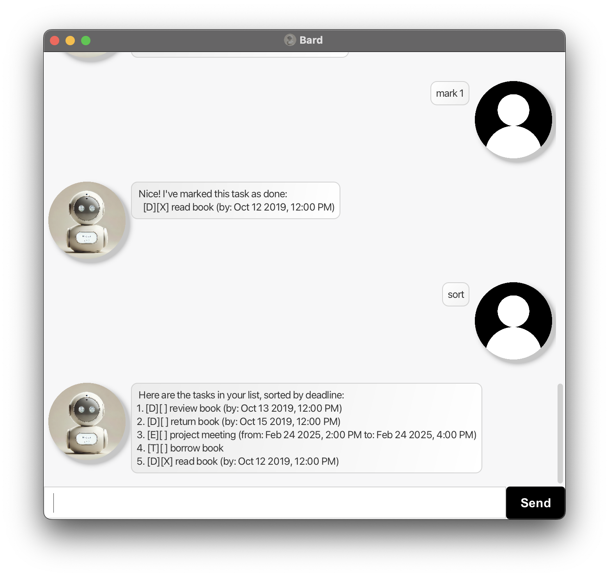

# Bard: Task Noting Chatbot

Bard is a **desktop chatbot for managing your tasks**. With a conversational interface and an elegant GUI, Bard lets you quickly add, update, and manage your tasks through simple commands. Whether you need to jot down a quick todo, schedule a deadline, or plan an event, Bard is designed to make task management efficient and enjoyable.



--------------------------------------------------------------------------------------------------------------------

## Quick Start

1. **Requirements:**  
   Ensure you have Java `17` or above installed on your system.  
   **Mac users:** Please refer to [this guide](https://se-education.org/guides/tutorials/javaInstallationMac.html) for installing the correct JDK version.

2. **Download the Application:**  
   Download the latest `.jar` file from the [Bard Releases](https://github.com/hyizhak/ip/releases) page.

3. **Set Up Your Workspace:**  
   Copy the `.jar` file to a folder of your choice.

4. **Run Bard:**  
   Open a command terminal (or Command Prompt), navigate to the folder containing the jar file, and run:
   ```bash
   java -jar bard.jar
    ```
   The GUI will appear shortly, displaying your tasks and a chat interface.
5. **Using Bard:**
   Type a command into the input field and press Enter to execute it. For example, typing help will display the help menu.

## Features

Bard supports a wide range of commands for managing your tasks. Below are the commands you can use:


**Notes about the command format:**<br>

* Commands are case-sensitive and must follow the prescribed format.

* Parameters are separated by spaces and specific delimiters (e.g., /by, /from, /to).

### Viewing help : `help`

Shows a message with concise help information and explaining how to access the help page.

Format: `help`

### Adding Tasks : todo, deadline, event

Adds a new task to your task list.
* Todo:
    * Format: `todo TASK_DESCRIPTION`
    * Example: `todo Buy groceries`
* Deadline:
    * Format: `deadline TASK_DESCRIPTION /by DATE [TIME]`
    * Examples: `deadline Submit report /by 2025-12-31 2359`
* Event:
    * Format: `event TASK_DESCRIPTION /from DATE [TIME] /to DATE [TIME]`
    * Example: `event Team meeting /from mon 0900 /to mon 1100`
  
**Notes:**
* Bard accepts both full date formats yyyy-MM-dd and day-of-week abbreviations (e.g., mon).
When a day-of-week is provided, Bard automatically sets the deadline to the next occurrence of that day.
* The time is optional and defaults to 1200 if not specified.

### Listing Tasks : list

Displays all tasks currently stored.
* Format: `list`

### Marking and Unmarking Tasks : mark, unmark

Marks a task as done or not done.
* Mark:
    * Format: `mark TASK_NUMBER`
    * Example: `mark 2` marks the second task as done
* Unmark:
	* Format: `unmark TASK_NUMBER`
	* Example: `unmark 2` marks the second task as not done

### Deleting a Task : delete

Removes a task from your list.
* Format: `delete TASK_NUMBER`
* Example: `delete 3` deletes the third task

### Finding Tasks : find

Searches for tasks that contain a specific keyword.
* Format: `find KEYWORD`
* Example: `find meeting` finds all tasks with the word "meeting" in their description

### Sorting Tasks : sort

Sorts tasks by priority. Tasks with nearer deadlines or earlier event start times are given higher priority, and tasks marked as done are always moved to the bottom.
* Format: `sort`

### Exiting Bard : bye

Closes the application.
* Format: `bye`


### Data Persistence

Bard automatically saves your tasks to `.data/tasks.txt` on your hard disk after every command that modifies the task list. There is no need for manual saving.

### Command Summary

| Command | Format | Example |
|---------|--------|---------|
| help | help | help |
| todo | todo TASK_DESCRIPTION | todo Buy groceries |
| deadline | deadline TASK_DESCRIPTION /by DATE [TIME] | deadline Submit report /by 2025-12-31 2359 |
| event | event TASK_DESCRIPTION /from DATE [TIME] /to DATE [TIME] | event Team meeting /from mon 0900 /to mon 1100 |
| list | list | list |
| mark | mark TASK_NUMBER | mark 2 |
| unmark | unmark TASK_NUMBER | unmark 2 |
| delete | delete TASK_NUMBER | delete 3 |
| find | find KEYWORD | find meeting |
| sort | sort | sort |
| bye | bye | bye |

## Known Issues

1.	Command Formatting:
Ensure commands follow the exact format. Extra spaces or incorrect delimiters may result in errors.

## Future Enhancements
* Integration with calendar and reminder applications.
* Advanced natural language processing for more intuitive command input.
* Enhanced error suggestions to help correct mistyped commands.

--------------------------------------------------------------------------------------------------------------------
enjoy using Bard to manage your tasks efficiently!